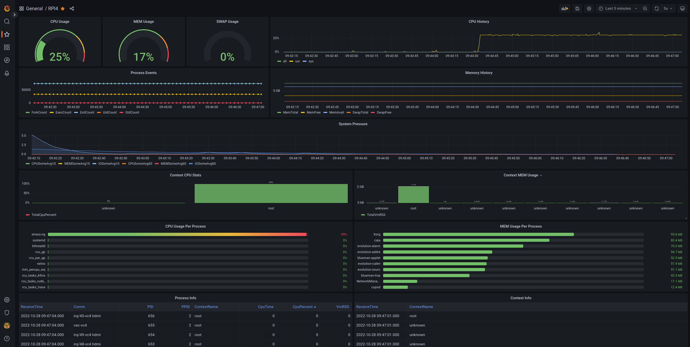

# TaskMonitor
Monitor and report performance indicators from embedded target systems



## Description
**TaskMonitor** is a system daemon that collects performance indicators and sends the data out from the system for processing. 
As part of the project group a set of tools is provided to store and process the output data.

### Components
| Component | Location | Description |
| ------ | ------ | ------ |
| taskmonitor | https://gitlab.com/taskmonitor/taskmonitor | System daemon running on target system (this project) |
| libtaskmonitor | https://gitlab.com/taskmonitor/libtaskmonitor | Protobuf interfaces to communicate with the daemon |
| tkmreader | https://gitlab.com/taskmonitor/tkm-reader | A simple reader that output data in SQLite and JSON formats |
| tkmcollector | https://gitlab.com/taskmonitor/tkm-collector | A data collector, SQL based, to be used in CI systems |

## Documentation
For more information about TaskMonitor check the manuals:   
    
* [User Manual](./manual/UserManual.md "User Manual")   
* [Developer Manual](./manual/DevelManual.md "Developer Manual")

## Download
Clone this repository with submodules:    
`# git clone --recurse-submodules https://gitlab.com/taskmonitor/taskmonitor.git`

## Dependencies
TaskMonitor depends on the following libraries

| Library | Reference | Info |
| ------ | ------ | ------ |
| libnl3 | https://www.infradead.org/~tgr/libnl | Used for netlink interfaces to taskstats if WITH_PROC_ACCT is enabled |
| libtaskmonitor | https://gitlab.com/taskmonitor/libtaskmonitor | TaskMonitor interfaces |
| protobuf | https://developers.google.com/protocol-buffers | Data serialization (libtaskmonitor dependency) |
| libsystemd | https://github.com/systemd/systemd/tree/main/src/libsystemd | Optional if WITH_SYSTEMD is ON |

## Build
### Build time options

| Option | Default | Info |
| ------ | ------ | ------ |
| WITH_SYSTEMD | ON | Enable systemd service, watchdog and journald support |
| WITH_STARTUP_DATA | ON | Support startup data cache with timeout |
| WITH_PROC_EVENT | ON | Enable ProcEvent module and support for event based process list|
| WITH_PROC_ACCT | ON | Enable ProcAcct module to provide TASKSTATS data |
| WITH_LXC | OFF | Use liblxc to set the context name for containers |
| WITH_TESTS | OFF | Build gtests for testing and coverage |
| WITH_INSTALL_CONFIG | ON | Install default taskmonitor.conf on target |
| WITH_INSTALL_LICENSE | ON | Install license file on target for QA checks |

### Local Build
> mkdir build && cd build && cmake .. && make

## Execute
The service needs elevated capabilities.    
  
To start in manually:    
> sudo taskmonitor -c /etc/taskmonitor.conf   

As a systemd service if WITH_SYSTEMD is ON:    
> sudo systemctl enable --now taskmonitor.service`

## Output sample
You can find bellow a short log sample on a Raspberry Pi4 target device

### Syslog output
```
Okt 05 07:33:13 rpi4dev systemd[1]: Started TaskMonitor Service.
Okt 05 07:33:14 rpi4dev taskmonitor[813]: Logging open for TaskMonitor
Okt 05 07:33:14 rpi4dev taskmonitor[813]: Profiling mode enabled
Okt 05 07:33:14 rpi4dev taskmonitor[813]: Update lanes interval fast=1000000 pace=5000000 slow=10000000
Okt 05 07:33:14 rpi4dev taskmonitor[813]: TCPServer listening on port: 3357
Okt 05 07:33:14 rpi4dev taskmonitor[813]: Control server listening on /run/taskmonitor/taskmonitor.sock
Okt 05 07:33:14 rpi4dev taskmonitor[813]: Startup data will expire in 60000000 usec
Okt 05 07:33:14 rpi4dev taskmonitor[813]: Netlink buffers msgBufferSize=1048576 txBufferSize=524288 rxBufferSize=524288
Okt 05 07:33:14 rpi4dev taskmonitor[813]: Read existing proc entries
Okt 05 07:33:14 rpi4dev taskmonitor[813]: Add process monitoring for pid=1 name=systemd context=root
Okt 05 07:33:14 rpi4dev taskmonitor[813]: Add process monitoring for pid=2 name=kthreadd context=root
Okt 05 07:33:14 rpi4dev taskmonitor[813]: Add process monitoring for pid=3 name=rcu_gp context=root
Okt 05 07:33:14 rpi4dev taskmonitor[813]: Add process monitoring for pid=4 name=rcu_par_gp context=root
Okt 05 07:33:14 rpi4dev taskmonitor[813]: Add process monitoring for pid=5 name=netns context=root
Okt 05 07:33:14 rpi4dev taskmonitor[813]: Add process monitoring for pid=6 name=kworker/0:0-events context=root
Okt 05 07:33:14 rpi4dev taskmonitor[813]: Add process monitoring for pid=7 name=kworker/0:0H-events_highpri context=root
Okt 05 07:33:14 rpi4dev taskmonitor[813]: Add process monitoring for pid=8 name=kworker/u8:0-events_unbound context=root
Okt 05 07:33:14 rpi4dev taskmonitor[813]: Add process monitoring for pid=9 name=mm_percpu_wq context=root
Okt 05 07:33:14 rpi4dev taskmonitor[813]: Add process monitoring for pid=10 name=rcu_tasks_kthre context=root
Okt 05 07:33:14 rpi4dev taskmonitor[813]: Add process monitoring for pid=11 name=rcu_tasks_rude_ context=root
Okt 05 07:33:14 rpi4dev taskmonitor[813]: Add process monitoring for pid=12 name=rcu_tasks_trace context=root
...
```

### Systemd status

```
● taskmonitor.service - TaskMonitor Service
     Loaded: loaded (/etc/systemd/system/taskmonitor.service; enabled; vendor preset: enabled)
     Active: active (running) since Sat 2022-10-15 10:08:52 CEST; 1 week 5 days ago
   Main PID: 813 (taskmonitor)
      Tasks: 1 (limit: 8885)
     Memory: 10.3M
        CPU: 1h 58min 14.496s
     CGroup: /system.slice/taskmonitor.service
             └─813 /usr/sbin/taskmonitor -c /etc/taskmonitor.conf

Okt 28 09:35:13 rpi4dev taskmonitor[813]: proc.event[gid]: process_pid=76007 process_tgid=76007 rgid=0 egid=0
Okt 28 09:35:13 rpi4dev taskmonitor[813]: proc.event[fork]: parent_pid=76007 parent_tgid=76007 child_pid=76008 child_tgid=76008
Okt 28 09:35:13 rpi4dev taskmonitor[813]: Add process monitoring for pid=76008 name=sudo context=root
Okt 28 09:35:13 rpi4dev taskmonitor[813]: proc.event[fork]: parent_pid=76008 parent_tgid=76008 child_pid=76009 child_tgid=76009
Okt 28 09:35:13 rpi4dev taskmonitor[813]: Add process monitoring for pid=76009 name=sudo context=root
Okt 28 09:35:13 rpi4dev taskmonitor[813]: proc.event[uid]: process_pid=76009 process_tgid=76009 ruid=0 euid=0
Okt 28 09:35:13 rpi4dev taskmonitor[813]: proc.event[exec]: process_pid=76009 process_tgid=76009
Okt 28 09:35:13 rpi4dev taskmonitor[813]: proc.event[fork]: parent_pid=76009 parent_tgid=76009 child_pid=76010 child_tgid=76010
Okt 28 09:35:13 rpi4dev taskmonitor[813]: Add process monitoring for pid=76010 name=(pager) context=root
Okt 28 09:35:13 rpi4dev taskmonitor[813]: proc.event[exec]: process_pid=76010 process_tgid=76010
```