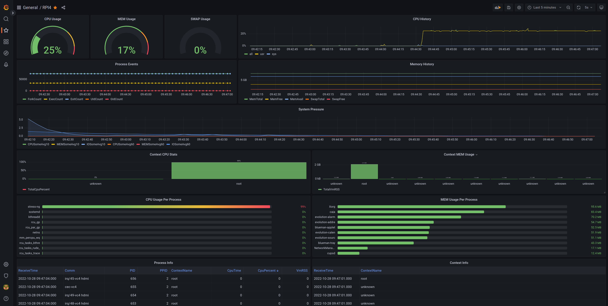

# User Manual
This manual will describe how to use TaskMonitor system components to collect and analyse data from a target system

## Precondition
We assume the TaskMonitor service is installed and running on a Linux based target. This can be a real hardware (embedded device or Linux machine) or a virtual machine. We will refer to this device as *the target*.

The TaskMonitor target device should be running with the following settings:
1. Profiling mode is enabled (see [taskmonitor.conf:L46](../config/taskmonitor.conf.in#L46))
2. TCP server is enabled (assume default port 3357, [taskmonitor.conf:L76](../config/taskmonitor.conf.in#L76))
3. Target device can accept connections on TaskMonitor TCP port (check device firewall configuration) 

## Data acquisition
The first step is to collect data from the target. There are currently two tools available:
1. [TkmReader](https://gitlab.com/taskmonitor/tkm-reader)
2. [TkmCollector](https://gitlab.com/taskmonitor/tkm-collector)


### TkmReader
This data aquisition tool can be used to collect data from a single device. It can output data in SQLite3 database or JSON (line delimited DOMs). For the purpose of this manual we will focus on SQLite3 data output since the visualization tools are easier to use. Follow the instructions to install TkmReader from projects page.   

#### Example
We want to collect data from a target device on local network with address *192.168.200.9* listening on default port *3357*. We will name this device *rpi4dev* and we are only interested in SQLite3 database output format which should be stored on host path */var/cache/tkm-collector/data.tkm.db*. To collect data we need to execute the following command on the host machine:
```
# tkmreader --init --verbose --name rpi4dev --address 192.168.200.9 --database /var/cache/tkm-collector/data.tkm.db
```
You can check tkmreader help for CLI arguments:
```
# tkmreader --help
TaskMonitorReader: read and store data from taskmonitor service
Version: 1.5.2 libtkm: 1.0.2

Usage: tkmreader [OPTIONS] 

  General:
     --name, -n      <string>  Device name (default unknown)
     --address, -a   <string>  Device IP address (default localhost)
     --port, -p      <int>     Device port number (default 3357)
     --verbose, -v             Print info messages
  Output:
     --init, -i                Force output initialization if files exist
     --database, -d  <string>  Path to output database file. If not set DB output is disabled
     --json, -j      <string>  Path to output json file. If not set json output is disabled
                               Hint: Use 'stdout' for standard output
  Help:
     --help, -h                Print this help
```
Since the verbose mode is enabled the handshake with the target device and data polling will be visible on the standard output
```
14:20:30 Request session
14:20:30 Monitor accepted session with id: 9981821832529528881
14:20:30 Reading data started for session: 9981821832529528881
14:20:30 Request Startup Data
14:20:31 Request SysProcMemInfo
14:20:31 Request SysProcStat
14:20:32 Request SysProcMemInfo
14:20:32 Request SysProcStat
14:20:33 Request SysProcMemInfo
14:20:33 Request SysProcStat
14:20:34 Request SysProcMemInfo
14:20:34 Request SysProcStat
14:20:35 Request ProcEvent
14:20:35 Request SysProcDiskStats
14:20:35 Request SysProcPressure
14:20:35 Request ProcInfo
14:20:35 Request ContextInfo
14:20:35 Request SysProcMemInfo
14:20:35 Request SysProcStat
...
```

### TkmCollector
This data aquisition tool can be used to collect data from multiple devices at the same time and store the output in a database. Currently PosgreSQL and SQLite3 database output are supported. Follow the instructions to install TkmCollector from projects page.

## Data visualization
Since data is stored in SQL and JSON output formats as time series the user is free to chose any visualization tool available for these formats. We propose the following tools:

1. [Grafana](https://grafana.com/)
2. [DB Browswer for SQLite](https://sqlitebrowser.org/)
3. [TkmViewer](https://gitlab.com/taskmonitor/tkmviewer)

### Live monitor with Grafana
A powerful method to visualize data from a live target is to use Grafana with SQLite3 plugin.

#### Install Grafana
Grafana can be installed as a docker container. We need to bind mount the path where SQLite database output is stored inside the container.

```
# docker run -d --name=grafana -p 3000:3000 -v /var/cache/tkm-collector:/tkm-collector grafana/grafana-oss
```

#### Install SQLite3 datasource
Follow the instructions to install SQLite3 datasource plugin for Grafana: [SQLite3 Datasource](https://grafana.com/grafana/plugins/frser-sqlite-datasource)

#### Configure SQLite3 datasource
In Grafana add a new SQLite datasouce named *SQLite* with the following settings:

* Path: `/tkm-collector/data.tkm.db`
* Path Prefix: `file:`
* Path Options: `mode=ro&_ignore_check_constrains=1&immutable=1`
* Secure Path Options:

Please note that Path option is pointing to the target bind mount directory for the output file. The tkmreader output will be open in read only mode by this data source.

#### Import and customize sample dashboard
For reference download and import the dashboard provided for RPI4 target device. You can customize this dashboard for your specific target by editing the SQL queries for each panel if needed. You can find the dashboard here: [RPI4 Dashboard Sample](./assets/RPI4-1671016536308.json)

#### Start data collector
Grafana dashboard for target device setup is complete. You can start *tkmreader* to collect the data. The dashboard will show live data:



### Offline data visualization with SqliteBrowser
The output data from tkmreader is a timeseries structured in several tables. Each target data source is stored in one table which can be queried using SQL.
Data can be visualized directly from table or queried using SQL for complex scenarios.


#### Useful SQL scripts
Here are some useful SQL sample query: 
+ [System CPU usage](./assets/tkm_system_cpu_usage.sql)
+ [System Memory usage](./assets/tkm_system_mem_usage.sql)
+ [System Pressure information](./assets/tkm_system_psi_usage.sql)
+ [Process CPU usage](./assets/tkm_process_cpu_usage.sql)
+ [Process Memory usage](./assets/tkm_process_mem_usage.sql)

#### DB Browser Project
Sample project for DB browser: 
+ [DB Browser Project](./assets/tkm_dbbrowser_sample_project.sqbpro)
